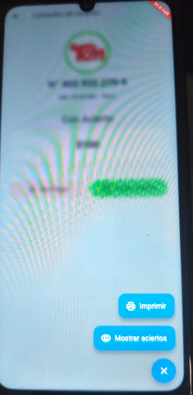
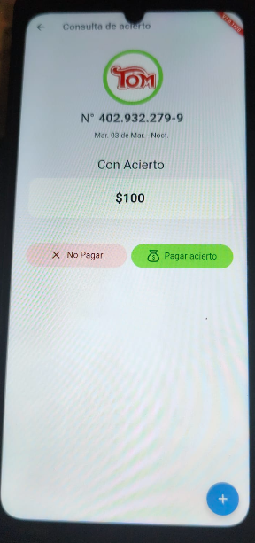

# Reporte de Bug: BUG-PAG-199 - Imprimir detalles del acierto antes de pagar

## 📋 Información General

- **ID:** BUG-PAG-199
- **Título:** Imprimir detalles del acierto antes de pagar (Escenarios 1 y 2)
- **Versión:** v1.0.1+20
- **Estado:** ✅ OK (v20) - Verificado con nota de mejora UX.

## 📝 Descripción
El requerimiento solicita que, al consultar un acierto, el sistema permita imprimir
una notificación (Felicidades) si está pendiente, o un comprobante informativo si
ya fue pago, sin necesidad de procesar el pago en ese instante.

## 🔍 Hallazgos (ver v20)

- Se identificó un botón **"+"** en la esquina inferior derecha de la pantalla de
  consulta de acierto.
- Al presionar el botón, se despliegan las opciones:
  - **Imprimir**: Genera el comprobante de notificación/información.
  - **Mostrar aciertos**: Muestra el desglose de jugadas ganadoras.

## 🖼️ Evidencia
### Interfaz de Consulta

### Opciones del Botón Contextual

> [!IMPORTANT]
> **Nota de UX:** El ícono "+" no es intuitivo para acciones de impresión.
> Se sugiere cambiar a un ícono de impresora o un menú contextual más explícito
> para seguir el standard de diseño premium.

## 🛠️ Pasos de Reproducción / Validación

1. Escanear ticket ganador (o ingresar manual).
2. En la pantalla "Con Acierto", presionar el botón **"+"**.
3. Seleccionar **"Imprimir"**.
4. Verificar que salga el ticket sin que el sistema obligue a pagar o cerrar
   el carrito.
