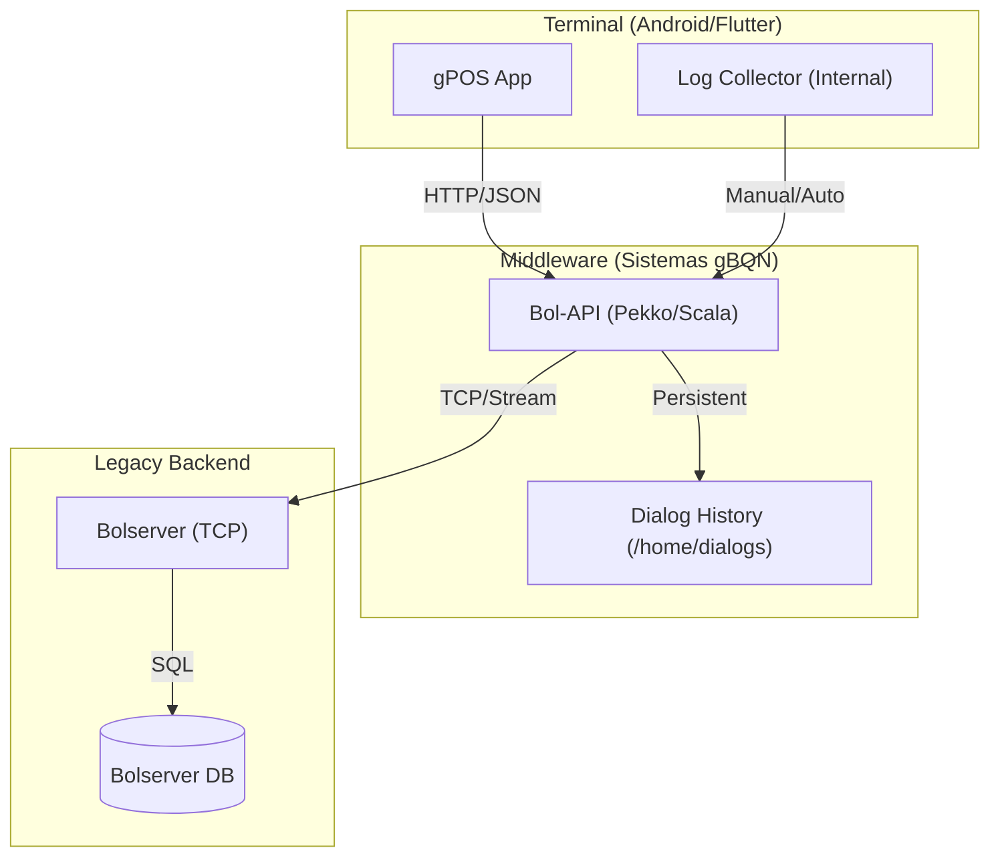

# 🏗️ Arquitectura y Trazabilidad QA (gPOS)

Para mejorar la visibilidad de los fallos y asegurar que no falten evidencias,
consolidamos la estructura del sistema y el flujo de datos.

## 1. Mapa de Arquitectura del Ecosistema



### Componentes Clave para QA

- **gPOS**: Interfaz de usuario y lógica local (timers, validaciones UI).
- **Bol-API**: El "Traductor". Convierte JSON a paquetes TCP.
  **Aquí se guardan los diálogos** que usamos como evidencia.
- **Dialogs**: Repositorio de archivos `.json` que registran cada interacción.
  Organizado por `año/mes/día`.

---

## 2. Sistema de Trazabilidad Interno (Timestamps)

Para evitar que te falten evidencias, vamos a implementar un sistema de
**"Timestamps de Sesión de Prueba"**.

### Formato de Registro sugerido

Cuando testees algo, anotá el timestamp interno de la terminal (el que aparece
en el reloj del POS) para luego cruzarlo con los diálogos del servidor.

| Evento de Test | Timestamp POS | ID de Diálogo (Esperado) | Observación |
| :--- | :--- | :--- | :--- |
| Inicio de Test | 11:30:00 | N/A | Sesión `ssn#241434` |
| Intento de Apuesta | 11:41:23 | `114123..._autorizar.json` | Fallo sorteo vencido |
| Refresco Manual | 11:45:10 | `114510..._get_config.json` | Se recuperan sorteos |

### Tip para evidencias rápidas

Si sabés la hora exacta del POS, podés buscar el diálogo por el prefijo:
`ls /opt/containers/bol-api/home/dialogs/2026/03/13/1141*`

---

## 3. Anatomía de un Diálogo (JSON)

Cada archivo en `/home/dialogs` es una evidencia. Entender su estructura es
vital para reportar bugs de lógica o cierres.

### Ejemplo: `cambio_cierre`

```json
{
  "id" : "59c64592-4fd8-41a7-af4b-c2e302ae6872", // Dialog UUID
  "serviceName" : "cambio_cierre",               // Acción realizada
  "start" : "2026-03-12T14:26:45.129...",       // Timestamp exacto
  "from" : "ssn#241434 pos.7004...",            // ID de Sesión y Terminal
  "request" : { ... },                          // Lo que el POS envió
  "response" : {                                // Lo que el Servidor respondió
    "statusCode" : 200,
    "entity" : { "sorteos": [...] }             // Datos de negocio
  },
  "duration" : 31                               // Tiempo de respuesta en ms
}
```

### Campos Críticos para el Reporte

- **`start`**: Usalo para demostrar que el diálogo ocurrió (o no) a tiempo.
- **`request -> fechaCierre`**: Verificá que el POS pida la fecha correcta.
- **`response -> entity -> sorteos`**: Aquí ves qué devolvió el servidor.
  - Si falta el sorteo aquí: Error de **Backend**.
  - Si está aquí pero el POS no lo muestra: Error de **App (Flutter)**.

---

## 4. Diferencia: Logs de Aplicación vs. Diálogos JSON

Es importante no confundir los dos tipos de registros que genera el sistema:

| Tipo | Ubicación | Uso Principal |
| :--- | :--- | :--- |
| **Diálogos JSON** | `/home/dialogs/YYYY/MM/DD/` | **Evidencia Pura**. |
| **Logs Bol-API** | `docker logs bol-api` | **Debugging**. Traza interna. |

### Cómo vincularlos

Si encontrás un error en el Log de Bol-API, buscá el campo **`Dialog: [UUID]`**.
Ese mismo UUID es el campo `"id"` dentro del archivo JSON del diálogo.

---

## 5. Glosario Técnico de Trazabilidad (Bol-API)

- **`ssn#XXXXXX`**: Session ID. Persiste mientas el POS esté encendido.
- **`pos.XXXX`**: ID único de la terminal física.
- **`Dialog` (UUID)**: ID de interacción. Vincula el log con la evidencia JSON.
